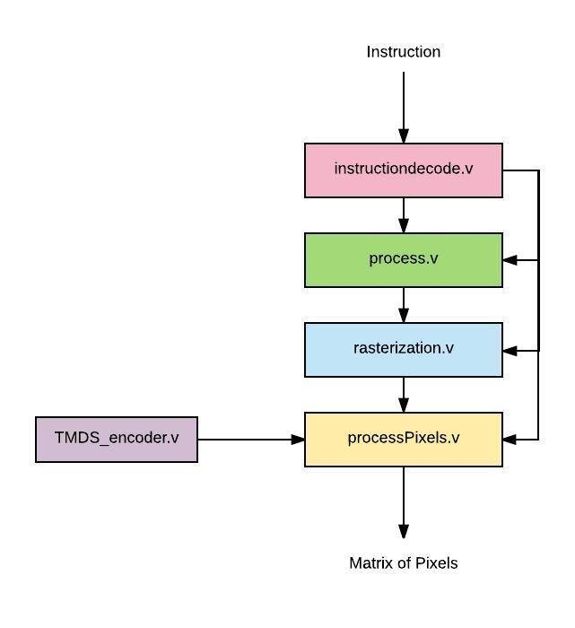
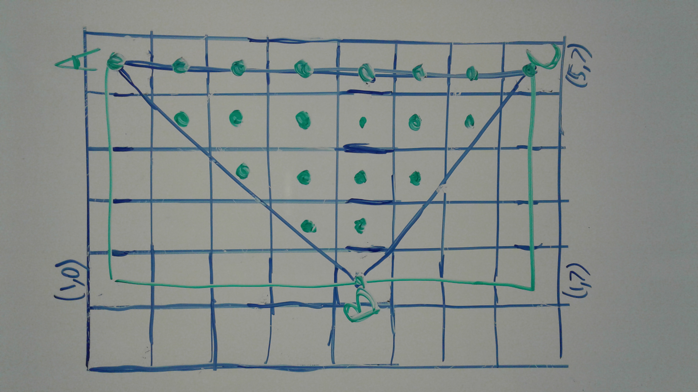

# Displaying Shapes With A GPU

## Introduction

We implemented a rudimentary graphics processing unit capable of creating and displaying basic shapes.

The graphics processing unit that we designed are comprised of few simple and basic components that does basic GPU functionalities. Those components are instruction decoder, instruction processor, rasterizer, and pixel display module. With the GPU that we created, we can turn a shape defined in terms of coordinates into a collection of pixels that can be showed in a display.

## Our Story
We decided to work on GPU’s because we wanted to build upon the skills that we had learned from completing our CPU’s. We wanted to make something more tangible that we had built as well. We also wanted to create something using verilog as well. We came across a description of what a GPU was and thought that it would be cool to work on a part that is so necessary for contemporary computers.

After deciding to pursue a GPU project, we looked up resources about how typical GPUs work. We were particularly inspired by [Peter Alexander Greczner’s implementation of a GPU](https://people.ece.cornell.edu/land/courses/eceprojectsland/STUDENTPROJ/2009to2010/pag42/Greczner_Meng_Final.pdf), because he used a reduced instruction set to construct pictures out of basic shapes (triangles, rectangles, etc). Using this as an inspiration, we decided on a similar, reduced instruction set consisting of drawing rectangles and triangles and filling them in with specific colors.

## How Our GPU Works

We constructed verilog modules for each of the steps listed above. 

## Our Approach
### First Step: Processing the Instruction
We tackled this problem by defining the goal we wanted from our project: the ability to construct basic shapes using a custom instruction set. In the beginning, we defined our instruction set with a few constraints in mind:

* We would represent colors with RGB, which meant that we needed 8 bits for each Red, Green, and Blue value. This means we need 24 bits allocated for these values

* The number of bits needed for the width and height of screen may change, so we had to parameterize these values. We would allocate an additional 4*(width+height) bits for this reason 

* Our basic shapes are triangles and rectangles, so we need another bit to distinguish between the two

After considering all the things we needed to get all the necessary points for the rasterization step. We made a new module called processInstruction that calculates the points needed given the operation in the instruction. 

### Second Step: Rasterization
The rasterization step is able to take in the 3 or 4 points specified by processInstruction and obtain all the pixels within the boundaries of those points. The procedure in stage depends on the shape, because calculating whether the inputs enclose a pixel is slightly more complex for a triangle than for a rectangle. 

### Third Step: Displaying Points on HDMI
After getting an array of coordinates from the rasterization step, we process that output in the pixel processing step. This step generates HDMI video signal to display a 640 x 480 screen with a 60 Hz refresh rate and 8-bit color. 

Displaying the 8-bit color involves encoding the 8 bit color values of each pixel using a special 8b/10b encoding algorithm called Transition Minimized Differential Signaling, or TMDS which manipulates the 8 bits of data and adds 2 control bits in order to minimize the number of transitions and balance the average number of 1s and 0s (this reduces noise when the signal is transmitted over physical wire). 

The 10 bit TMDS encoded color values are then serialized and synchronized to the HDMI pixel clock and output over 3 differential data lines (one for red, one for green, and one for blue). The pixel clock is also output differentially, following the HDMI specification.

### Final Step: Transitioning to the FPGA

### Verifying These Steps
We constructed testbenches for each component to make sure they worked as expected. 

## Some Results

## Trying This At Home
This project was especially new for each of us, so we faced a few challenges along the way. We would like to explain a few of those challenges, describe possible next steps, and thank some of the resources we've used.

### Before You Start, Be Sure You Know:
* If you are starting from scratch, make sure your verilog modules can communicate with each other seamlessly
* HDMI has tricky input and output specifications
* Using while loops and 2D arrays may be tempting, but they are almost impossible to synthesize in FPGA

### Possible Next Steps:
* We can extend our GPU to ...

### Resources Used
* 
