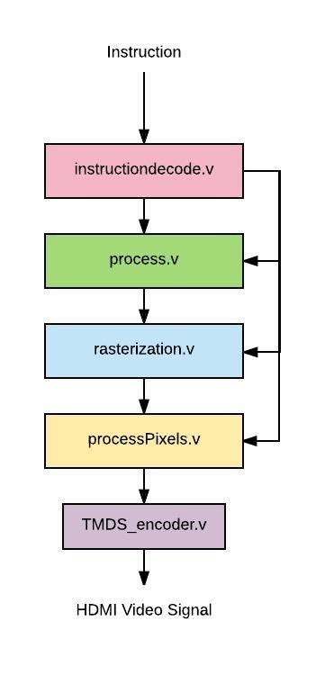
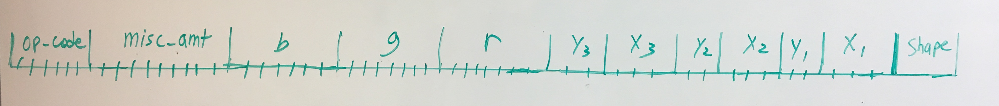
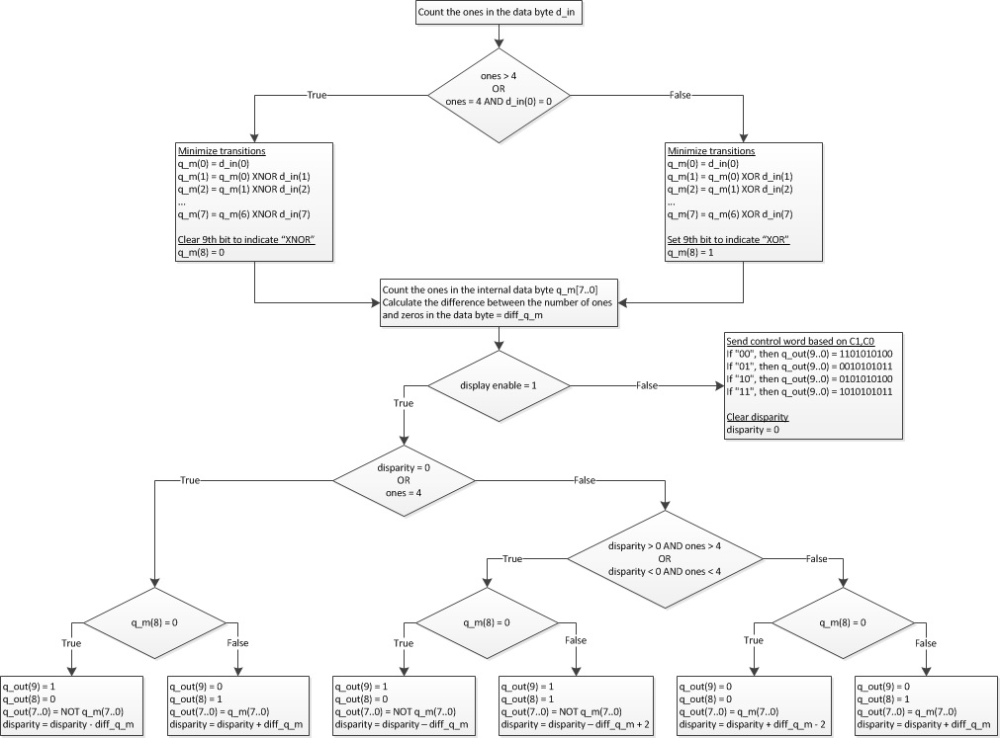

# Displaying Shapes With A GPU

## Introduction

We implemented a rudimentary graphics processing unit capable of creating and displaying basic shapes.

The graphics processing unit that we designed is comprised of a few simple and basic components that do basic GPU functionalities. Those components are instruction decoder, instruction processor, rasterizer, and pixel display module. With the GPU that we created, we can turn a shape defined in terms of coordinates into a collection of pixels that can be showed in a display.

## Our Story
We decided to work on GPU’s because we wanted to build upon the skills that we had learned from completing our CPU’s. We wanted to make something more tangible that we had built ourselves. We wanted to create something using verilog as well. We came across a description of what a GPU was and thought that it would be cool to work on a part that is so necessary for contemporary computers.

After deciding to pursue a GPU project, we looked up resources about how typical GPUs work. We were particularly inspired by [Peter Alexander Greczner’s implementation of a GPU](https://people.ece.cornell.edu/land/courses/eceprojectsland/STUDENTPROJ/2009to2010/pag42/Greczner_Meng_Final.pdf), because he used a reduced instruction set to construct pictures out of basic shapes (triangles, rectangles, etc). Using this as an inspiration, we decided on a similar, reduced instruction set consisting of drawing rectangles and triangles and filling them in with specific colors.

## How Our GPU Works

We constructed verilog modules for each of the stages listed above. 
**instructiondecode**: In instructiondecode.v. This module parses the incoming instruction by index. 

**processInstruction**: In process.v. This module calculates the 4th point of the rectangle if the shape bit insists on it.

**rasterize**: In rasterization.v. This module generates a 1-D array of all the points needed for the processPixels step

**processPixels**: In processPixels.v, This module prepares the listed pixel values for synthesizing with HDMI

**TMDS_encoder**: In TMDS_encoder.v. This module facilitates processPixels.v in preparing the pixels for displaying on HDMI

## Our Approach
### First Step: Processing the Instruction
We tackled this problem by defining the goal we wanted from our project: the ability to construct basic shapes using a custom instruction set. In the beginning, we defined our instruction set with a few constraints in mind:

* We would represent colors with RGB, which meant that we needed 8 bits for each Red, Green, and Blue value. This means we need 24 bits allocated for these values

* The number of bits needed for the width and height of screen may change, so we had to parameterize these values. We would allocate an additional 4*(width+height) bits for this reason 

* Our basic shapes are triangles and rectangles, so we need another bit to distinguish between the two

After considering all the things we needed to get all the necessary points for the rasterization step. We made a new module called processInstruction that calculates the points needed given the operation in the instruction. 

### Second Step: Rasterization
The rasterization step is able to take in the 3 or 4 points specified by processInstruction and obtain all the pixels within the boundaries of those points. The procedure in stage depends on the shape, because calculating whether the inputs enclose a pixel is slightly more complex for a triangle than for a rectangle. 

### Third Step: Displaying Points on HDMI
After getting an array of coordinates from the rasterization step, we process that output in the pixel processing step. This step generates HDMI video signal to display a 640 x 480 screen with a 60 Hz refresh rate and 8-bit color. 

Displaying the 8-bit color involves encoding the 8 bit color values of each pixel using a special 8b/10b encoding algorithm called Transition Minimized Differential Signaling, or TMDS which manipulates the 8 bits of data and adds 2 control bits in order to minimize the number of transitions and balance the average number of 1s and 0s (this reduces noise when the signal is transmitted over physical wire). The TMDS algorithm is a two-step encoding process in which all but the least significant bit (which is left unchanged) is either XOR or XNOR transformed with the previous bit based on which one produces fewer transitions. The first control bit (the 9th bit) encodes whether XOR or XNOR was used. The second step involves optionally inverting the lower 8 bits (all of the data bits but not the control bits) based on which results in lower disparity between the number of ones and the number of zeros in the data byte. The 10th bit (most significant bit) encodes whether or not the data byte was inverted. The actual algorithm for implementing this is shown in the flow diagram below (from [EE Wiki Description of TMDS Encoding](https://eewiki.net/pages/viewpage.action?pageId=36569119))  

The 10 bit TMDS encoded color values are then serialized and synchronized to the HDMI pixel clock and output over 3 differential data lines (one for red, one for green, and one for blue). The pixel clock is also output differentially, following the HDMI specification.

### Final Step: Transitioning to the FPGA
When synthesizing our code onto the FPGA, we needed to set up port definitions in a Vivado constraints file as well as set up a Mixed-Mode Clock Manager (MMCM) module to generate both the 25 MHz pixel clock and the 250 MHz TMDS serializer clocks from the 125 MHz system clock.

## Some Results
We constructed testbenches for each component to make sure they worked as expected. We approached first and second steps by inputting predefined instructions for various screen widths and heights. These predefined instructions would make it easy for us to see if we obtained the right coordinates, shape value, and color values.

Wave-Viewer Output For the Instruction Decode Testbench

After verifying the working condition of the individual processinstruction, instructiondecode, and rasterize modules, we constructed a top-level module that initializes all of these modules and used GTKWave to make sure the outputs behave as expected. 

## Trying This At Home
This project was especially new for each of us, so we faced a few challenges along the way. We would like to explain a few of those challenges, describe possible next steps, and thank some of the resources we've used.

### Before You Start, Be Sure You Know:
* If you are starting from scratch, make sure your verilog modules can communicate with each other seamlessly
* The HDMI video specification is tricky, specifically it requires that data be TMDS encoded and then serialized. Even for low resolution HDMI (640 x 480) the serialization necessary to transmit the 10 bit encoded color data each rising edge of the pixel clock requires a very high frequency clock (250 MHz) that is synchronized to the pixel clock - timing is crucial and not very forgiving.
* Using while loops and 2D arrays may be tempting, but they are almost impossible to synthesize in FPGA. Once again, you will need creative work-arounds, such as using a fixed for loop
* If you are thinking of integrating C code with this hardware implementation, you will need to do additional research about high-level synthesis (HDL) to make sure the GPU is synthesizable
* Even if a function compiles in verilog, it may not synthesize once put onto an FPGA. Also sometimes things will not synthesize the way you think they will. Verifying your results each step of the way is very helpful and saves a lot of time (i.e. checking to make sure the synthesis results seem reasonable before running implementation etc.)

### Possible Next Steps:
We can extend our GPU to ...

* Draw more shapes and perform transformations on them. Our original goal was to create a GPU that could draw a rectangle or triangle and be able to perform different operations on them (such as scaling, rotation, mirroring etc.). We were not able to implement these functions because of the difficulties of performing transformations in verilog. However, in the future we would have liked to have been able to rotate and flip multiple different shapes that we are able to define.

* Run multiple processes at once. In a real GPU, there are many cores that are able to perform in parallel. This would have enabled us to draw multiple shapes at once, or perform operations on a shape while another was being drawn. This would have made our GPU behave much more similarly to an actual GPU. While we originally intended to have one or two cores running in parallel, this was definitely a stretch goal for us.

* Communicate with a CPU. While, for the purposes of this project, we blackboxed the CPU, in a real computer, the GPU and CPU interface with each other, with the CPU giving the GPU commands, while the GPU performs calculations and executes the commands. In the future, it would have been cool working with that interface between parts.

### Resources Used
* [Peter Alexander Greczner’s implementation of a GPU](https://people.ece.cornell.edu/land/courses/eceprojectsland/STUDENTPROJ/2009to2010/pag42/Greczner_Meng_Final.pdf)
* [How A GPU Works](https://www.cs.cmu.edu/afs/cs/academic/class/15462-f11/www/lec_slides/lec19.pdf)
* [EE Wiki Description of TMDS Encoding](https://eewiki.net/pages/viewpage.action?pageId=36569119)
* [Wikipedia Article on TMDS Encoding](https://en.wikipedia.org/wiki/Transition-minimized_differential_signaling)
